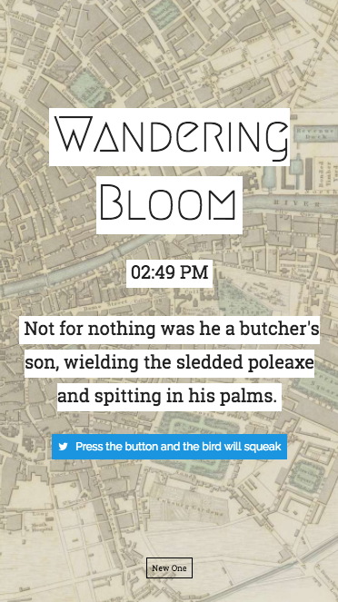

# WANDERING BLOOM

Pineapple rock, lemon platt, butter scotch.

Playing with Rails 5 and James Joyce's Ulysses. This app parses the text of the entire novel. Ulysses takes place in a single day and chapters of the book correspond to times of the day. The API endppint will return a sentence that takes place at the time the api is called.

[Production Site](http://www.wanderingbloom.com/)

### Features

- Text parsing and PostgreSQL integration
- - Ulysses is a long book
- Twitter integration

